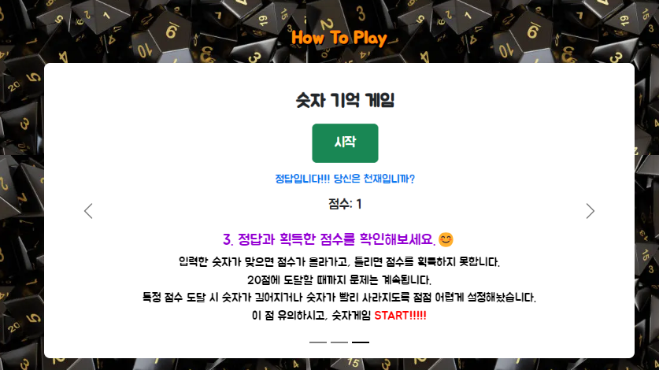

# 숫자 게임

- 랜덤으로 생성되는 숫자를 사용자가 기억하는 게임.

## 게임 과정

1. 시작버튼을 누르면 사용자는 랜덤으로(`Math.floor`와 `Math.random` 사용) 생성되는 숫자를 보게됨.

```js
  // 1000~9000 범위의 자연수를 만들어내야함
  // random으로 0~1사이에 숫자 아무거나 하나 생성하고,
  // floor로 소수를 내림처리하기.
  startButton.addEventListener("click", function () {
    if (score < 6) {
      randomNumber = Math.floor(1000 + Math.random() * 9000);
    } else if (score < 11) {
      randomNumber = Math.floor(10000 + Math.random() * 90000);
    } else if (score < 16) {
      randomNumber = Math.floor(100000 + Math.random() * 900000);
    } else {
      randomNumber = Math.floor(100000000 + Math.random() * 9000000);
    }
```

2.  사용자는 입력란에 기억한 숫자를 작성하고 제출 버튼을 누름.

3.  정답이면 점수를 1점 획득, 그렇지 않으면 점수를 획득하지 못함.

```js
submitButton.addEventListener("click", function () {
  const Guess = userInput.value;
  // 뭔가... 다양한 리액션을 제공하고 싶음.
  let option = Math.floor(1 + Math.random() * 5); //1~5사이 숫자
  if (Guess == randomNumber) {
    if (score == 19) {
      scoreDisplay.textContent = `✨✨우와! 😎마지막 문제😎까지 풀어내다니!!🎉 🤩🎈🎉축하합니다!!🎈🎉🤩 
        (다시 게임을 진행하고 싶으시면 새로고침을 눌러주세요!)`;
      userInput.value = "";
      inputArea.style.display = "none";
    } else {
      switch (option) {
        case 1:
          message.textContent = "정답입니다!!! 당신은 천재입니까?";
          break;
        case 2:
          message.textContent = "정답입니다!!! 점수 획득!!!";
          break;
        case 3:
          message.textContent = "정답입니다!!! 축하축하 ><";
          break;
        case 4:
          message.textContent = "정답입니다!!! 당신의 IQ는 200인거죠?";
          break;
        case 5:
          message.textContent = "정답입니다!!! 정말 대단해요 !!!!";
          break;
      }
      score++;

      startButton.style.display = "block";
      scoreDisplay.textContent = `점수: ${score}`;
      userInput.value = "";
      inputArea.style.display = "none";
    }
  } else {
    message.textContent = `오답입니다 ㅠㅠ. 정답은 ${randomNumber}입니다.`;
    // 틀렸을떄는, 정중하게 말하기 ㅎㅎ
    startButton.style.display = "block";
    scoreDisplay.textContent = `점수: ${score}`;
    userInput.value = "";
    inputArea.style.display = "none";
  }
});
```

4. 특정 단계(점수)에 도달하면(+5점마다// 5점, 10점, 15점 ...) 기억해야할 숫자의 자리수가 하나씩 늘어남. 또한, 특정 점수 도달하기 전까지는 1점씩 획득할 때마다 숫자가 사라지는 시간이 짧아짐. --> 난이도를 일부러 점점 어렵게 설정함.

```js
//점수가 0일때는 기존 조건처럼 3초
// 각 단계마다 점수가 하나씩 올라갈때마다 조금 더 빠르게 진행하고 싶음.
// 점수 나누기 5의 나머지를 기준으로 숫자 자리수가 하나씩 늘기전까지는 조금씩 더 빠르게 만들었음
let remainder = score % 5;
if (score == 0 || remainder == 1) {
  setTimeout(function () {
    numberDisplay.textContent = "";
    inputArea.style.display = "block";
  }, 3000);
} else if (remainder == 0) {
  setTimeout(function () {
    numberDisplay.textContent = "";
    inputArea.style.display = "block";
  }, 3000 * (1 / 5));
} else if (remainder == 2) {
  setTimeout(function () {
    numberDisplay.textContent = "";
    inputArea.style.display = "block";
  }, 3000 * (1 / 2));
} else if (remainder == 3) {
  setTimeout(function () {
    numberDisplay.textContent = "";
    inputArea.style.display = "block";
  }, 3000 * (1 / 3));
} else if (remainder == 4) {
  setTimeout(function () {
    numberDisplay.textContent = "";
    inputArea.style.display = "block";
  }, 3000 * (1 / 4));
}
```

### 추가적인 내용

1. 부트스트랩에서 carousel를 사용해서 사용자가 숫자게임이 어떻게 진행되는지 그 설명을 볼 수 있게 함.



  - 이미지 크기가 달라지면, 슬라이드가 자동으로 넘어갈 때 크기가 resizing되는 과정에 의해 갑자기 커지거나 줄어들 수 있음. 이 문제를 해결하기 위해 클래스 이름을 `carousel_box`로 설정한 `div` 태그로 bootstrap에서 가져온 carousel 코드를 감싸주었다. 이후 `carousel_box`의 width에 값을 지정하여 이미지에 의해 크기가 갑자기 변하는 문제를 해결했다.
